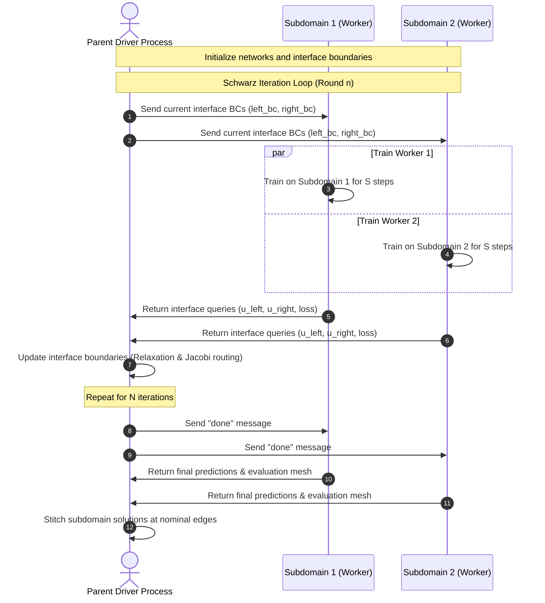
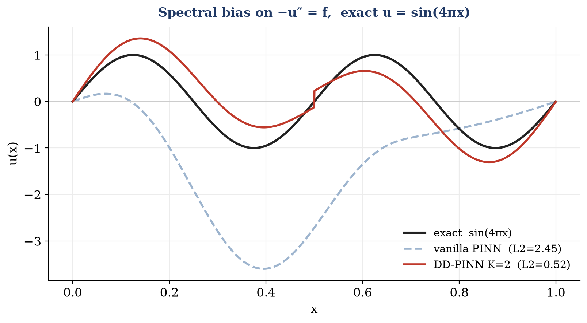
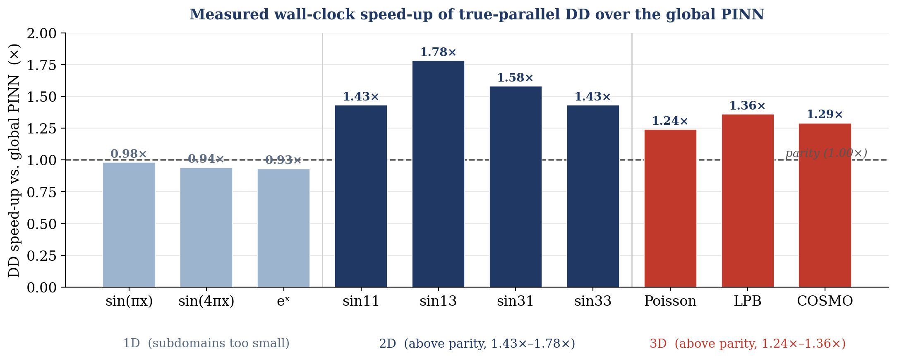

# DD-ANN: Domain Decomposition Accelerated Neural Networks

**Scalable, parallel, mesh-free PDE solvers combining Physics-Informed Neural Networks (PINNs) with overlapping Schwarz domain decomposition.**

Developed at the **Indian Institute of Technology Gandhinagar** under the **Summer Research Internship Program (SRIP) 2026**.

**Authors:** Krishna (VIT Vellore) & Chitiveli Hemcharan Varma (IIT Gandhinagar)  
**Supervisor:** Dr. Abhinav Jha (Department of Mathematics, IIT Gandhinagar)

---

## 📖 Overview

Conventional Physics-Informed Neural Networks (PINNs) offer a mesh-free, fully differentiable alternative to traditional PDE solvers like the Finite Element Method (FEM). However, they suffer from two major scaling issues:
1. **Spectral Bias:** Neural networks learn low-frequency features rapidly but struggle with high-frequency, oscillatory solutions.
2. **Computational Cost:** Training a single large neural network over a high-dimensional domain is slow and cannot be easily parallelized.

**DD-ANN** resolves these limitations by splitting the computational domain into overlapping subdomains. Small, independent neural networks are trained concurrently on separate subdomains and coupled iteratively using a **Jacobi-style overlapping Schwarz iteration**.

```
                           DOMAIN DECOMPOSITION (K = 2 Strips)
             ┌──────────────────────┬──────────────────────┐
             │     Subdomain 1      │     Subdomain 2      │
             │       ┌──────────────|──────────┐           │
             │       │              │          │           │
             │       │      Overlap │ Region   |           │
             │       │              │          │           │
             │       │              │          │           │
             │       └──────────────|──────────┘           │
             │     x = a            |         x = b        │
             x = 0 ______________________________________x = 1
```

Because each subdomain network only solves a local, lower-frequency sub-problem:
* **Spectral bias is mitigated:** Each network effectively sees a lower spatial frequency.
* **Genuine process-level parallelism is achieved:** Subdomain networks train simultaneously on multiple CPU cores.

---

## 🧮 Mathematical Formulation

### 1. The Governing Elliptic PDEs
We validate DD-ANN on a family of coercive elliptic operators on the unit hypercube $\Omega = [0,1]^d$:

* **1D / 2D Poisson:**
  $$-&Delta; u = f, \quad u\big|_{&part;\Omega} = 0$$
* **3D Poisson (Uniform Dielectric):**
  $$-&Delta; u = f, \quad u\big|_{&part;\Omega} = 0$$
* **3D Linearized Poisson–Boltzmann (LPB) (Debye screening):**
  $$-&Delta; u + \kappa^2 u = f, \quad u\big|_{&part;\Omega} = 0$$
  where $\kappa$ represents the inverse Debye screening length.
* **3D COSMO (Variable Dielectric):**
  $$-&nabla; \cdot (&epsilon;(\mathbf{r}) &nabla; u) = f, \quad u\big|_{&part;\Omega} = 0$$
  where $&epsilon;(\mathbf{r}) = 1 + a_x x + a_y y + a_z z$ is an affine dielectric function representing the boundary interface between a solute and a solvent.

---

### 2. Exact Boundary Conditions (Hard Constraints)
Instead of enforcing boundary conditions (BCs) through soft penalties in the loss function, DD-ANN imposes them **exactly** by construction using a distance-function ansatz:
$$u_&theta;(\mathbf{x}) = \text{lift}(\mathbf{x}) + d(\mathbf{x}) N_&theta;(\mathbf{x})$$

Where $d(\mathbf{x})$ is a boundary distance function that vanishes on $&part;\Omega$:
* **1D:** $d(x) = (x-a)(x-b)$ on subdomain $[a,b]$.
* **2D:** $d(x,y) = x(1-x)y(1-y)$ on $[0,1]^2$.
* **3D:** $d(x,y,z) = x(1-x)y(1-y)z(1-z)$ on $[0,1]^3$.

Since $d(\mathbf{x}) = 0$ on $&part;\Omega$, the boundary conditions hold exactly for any neural network output $N_&theta;$. The training objective is simplified to the **pure PDE residual**:
$$L(&theta;) = \frac{1}{N} \sum_{i=1}^N \left( \mathcal{R}(u_&theta;(\mathbf{x}_i)) \right)^2$$

---

### 3. Interface Transmission Mechanisms
Subdomains exchange boundary data along their overlapping interfaces using two different mechanisms:

| Dimension | Interface Type | Coupling Mechanism |
|:---|:---|:---|
| **1D** | Single points ($x = \text{const}$) | **Hard Injection:** Neighbors' interior values are directly substituted into the subdomain's linear $\text{lift}(\mathbf{x})$ term. Interface continuity is enforced by construction. |
| **2D** | Lines ($x = \text{const}$) | **Soft Penalty:** Subdomains add a weighted least-squares penalty ($w = 300$) pulling their boundary profile toward the neighbor's frozen interior profile. |
| **3D** | Planes ($x = \text{const}$) | **Soft Penalty:** The interface plane is sampled on a $16 \times 16$ grid over $(y,z)$. Slabs add a penalty pulling their boundary profiles toward the neighbor's frozen values. |

---

### 4. Overlapping Schwarz Convergence
The necessity of domain overlap is established analytically. For two overlapping subdomains $\Omega_1 = (0, \gamma_2)$ and $\Omega_2 = (\gamma_1, 1)$ where $0 < \gamma_1 < \gamma_2 < 1$, the alternating Schwarz error contracts geometrically per round by a contraction factor $\rho$:

$$\rho = \left( \frac{\gamma_1}{\gamma_2} \right) \cdot \left( \frac{1-\gamma_2}{1-\gamma_1} \right) < 1$$

As the overlap $(\gamma_2 - \gamma_1) \to 0$, the contraction factor $\rho \to 1$, indicating that convergence rate degrades and overlap is mathematically mandatory.

---

## 🖥️ System Architecture & Parallelism

DD-ANN employs a multi-process execution framework designed around Python's Global Interpreter Lock (GIL) and CPU architecture constraints:

```mermaid
graph TD
    subgraph Master Process [Master Process (Main Thread)]
        Driver[Parent Driver / IPC Orchestrator]
        Stitcher[Nominal Edge Stitching]
        Timer[time.perf_counter Evaluation]
    end
    
    subgraph Subdomain Workers [Concurrent Subdomain Workers (torch.multiprocessing)]
        direction LR
        W1[Worker 1: Subdomain 1 <br> Pins: torch.set_num_threads(1)]
        W2[Worker 2: Subdomain 2 <br> Pins: torch.set_num_threads(1)]
    end
    
    Driver <-->|IPC Pipe 1: sends BCs / receives interface queries| W1
    Driver <-->|IPC Pipe 2: sends BCs / receives interface queries| W2
    
    W1 -.->|Query evaluation at a_2| W2
    W2 -.->|Query evaluation at b_1| W1
    
    W1 -->|Final pred| Stitcher
    W2 -->|Final pred| Stitcher
```

### Multiprocessing Sequence
1. The **Parent Driver** spawns persistent worker processes using the PyTorch `spawn` start method.
2. Each worker builds its network and optimizer once and keeps them in memory across all Schwarz iterations.
3. In each round, workers train for a fixed number of steps ($S$) against the neighbor's frozen boundary values.
4. Workers evaluate their solutions at neighbor interface coordinates and publish values via IPC pipes.
5. The parent process routes the interface boundaries (applying Jacobi relaxation) for the next round.
6. When complete, workers send subdomain predictions to the parent, which stitches them at the nominal edges.



### Crucial CPU Pins
* **BLAS Core Pinning:** To prevent workers from contending for the same physical cores, each subdomain pins `torch.set_num_threads(1)`.
* **Performance-Core Constraints:** The Schwarz iteration acts as a synchronization barrier. To achieve true speed-up on asymmetric hardware (like Apple Silicon M-series), the subdomain count $K$ is matched to the number of physical performance cores.

---

## 📊 Benchmark Results

All measurements are obtained on an **Apple M3** (4 performance + 4 efficiency cores), Python 3.13, PyTorch 2.9, executing on **CPU** (unpinned for vanilla, single-threaded for DD subdomains).

### 1. Phase 1 — 1D Poisson Results
In 1D, subdomains are too small to outpace multiprocessing communication overhead at depth-3, but they deliver massive accuracy gains:

**Table 1: 1D Accuracy (relative $L_2$ error, 6000 steps)**
| Problem | Vanilla | DD (K=2) | Error Reduction |
|:---|:---:|:---:|:---:|
| $\sin(\pi x)$ (smooth) | 1.89e-03 | 1.46e-03 | 1.3× |
| **$\sin(4\pi x)$ (high-freq)** | **2.45e+00** | **5.22e-01** | **4.7×** |
| $e^x$ (non-zero BC) | 3.36e-04 | 1.06e-03 | 0.3× |

**Table 2: 1D Wall-Clock vs. Network Depth on $\sin(4\pi x)$**
| Depth | Vanilla params | DD params (K=2) | Speed-up (DD/vanilla) |
|:---:|:---:|:---:|:---:|
| 3 | 4,654 | 4,418 | 0.94× (Overhead-bound) |
| 5 | 9,166 | 8,642 | 0.99× |
| 8 | 15,934 | 14,978 | **1.06×** |

*Increasing workload per subdomain (depth) allows DD to cross parity and achieve a wall-clock win.*

---

### 2. Phase 2 — 2D Poisson Results
2D strips carry larger workloads, placing DD comfortably above parity across all benchmark problems:

**Table 3: Full 2D Sweep — Vanilla vs. Sequential vs. Parallel DD ($K=2$)**
| Problem | $L_2$ van | $L_2$ DD | van (s) | seq (s) | par (s) | Speed-up (par/seq) | Speed-up (par/van) |
|:---|:---:|:---:|:---:|:---:|:---:|:---:|:---:|
| Poisson sin11 | 1.24e-04 | 4.96e-03 | 42.48 | 45.38 | 29.65 | 1.53× | **1.43×** |
| Poisson sin13 | 2.44e-02 | 1.57e-02 | 49.06 | 44.66 | 27.49 | 1.62× | **1.78×** |
| Poisson sin31 | 1.20e-02 | 2.33e-01 | 43.92 | 44.90 | 27.84 | 1.61× | **1.58×** |
| Poisson sin33 | 1.71e-01 | 1.85e-01 | 44.67 | 45.65 | 31.34 | 1.46× | **1.43×** |
| Helmholtz k1  | 2.00e+00 | 2.00e+00 | 45.26 | 44.65 | 29.19 | 1.53× | **1.55×** |
| Helmholtz k4  | 2.00e+00 | 2.00e+00 | 44.85 | 44.03 | 27.03 | 1.63× | **1.66×** |
| Helmholtz k9  | 2.40e+00 | 2.05e+00 | 43.88 | 45.71 | 27.51 | 1.66× | **1.60×** |

*Note: Helmholtz cases fail on both vanilla and DD due to Poisson-tuned hyperparameters, showing a training constraint rather than a DD defect.*

---

### 3. Phase 3 — 3D Electrostatic Results
3D operators are decomposed into 2 overlapping slabs. Timings show a consistent parallel speed-up:

**Table 4: 3D Electrostatics Sweep ($K=2$, matched capacity)**
| Problem | Operator | $L_2$ van | $L_2$ DD | van (s) | seq (s) | par (s) | DD/seq | DD/van |
|:---|:---|:---:|:---:|:---:|:---:|:---:|:---:|:---:|
| `pois_111` | $-\Delta u = f$ | 1.61e-03 | 1.55e-02 | 53.70 | 59.53 | 43.18 | 1.38× | **1.24×** |
| `lpb_k3` | $-\Delta u + \kappa^2 u = f$ | 2.68e-02 | 3.43e-02 | 60.40 | 59.40 | 44.56 | 1.33× | **1.36×** |
| `cosmo_mid` | $-\nabla\cdot(\varepsilon\nabla u) = f$ | 3.16e-02 | 3.53e-02 | 64.93 | 65.87 | 50.25 | 1.31× | **1.29×** |

---

### 4. Right-Sizing Subdomain Networks
Holding the global vanilla network size fixed, we shrink the subdomain network width ($m \to t$) to examine capacity limits:

**Table 5: Matched-Capacity vs. Tuned Subdomain Sizing ($K=2$)**
| Dim | Problem | Matched Width | Matched $L_2$ | Matched Speed-up | Tuned Width | Tuned $L_2$ | Tuned Speed-up |
|:---:|:---|:---:|:---:|:---:|:---:|:---:|:---:|
| **1D** | $\sin(\pi x)$ | 32 | 1.46e-03 | 0.89× | **8** | 1.49e-03 | **1.13×** |
| **1D** | $\sin(4\pi x)$ | 32 | 5.22e-01 | 0.87× | **8** | 5.70e-01 | **1.06×** |
| **2D** | $\sin(\pi x)\sin(\pi y)$ | 64 | 4.96e-03 | 1.40× | **20** | 5.05e-03 | **2.64×** |
| **2D** | $\sin(\pi x)\sin(3\pi y)$ | 64 | 1.57e-02 | 1.38× | **20** | 2.93e-02 | **2.97×** |
| **2D** | $\sin(3\pi x)\sin(3\pi y)$ | 64 | 1.85e-01 | 1.16× | **48** | 1.89e-01 | **1.13×** |
| **3D** | Poisson | 64 | 1.55e-02 | 1.21× | **48** | 1.75e-02 | **1.72×** |
| **3D** | LPB ($\kappa=3$) | 64 | 3.43e-02 | 1.28× | **48** | 5.09e-02 | **1.89×** |
| **3D** | COSMO | 64 | 3.53e-02 | 0.90× | **48** | 5.18e-02 | **1.44×** |

*Shrinking subdomain capacity significantly reduces the training cost, pushing 2D speed-ups close to **3.0×** and 3D speed-ups close to **1.9×**.*

---

## 📈 Visualizations

### 1. Spectral Bias Mitigation
On high-frequency targets, vanilla PINNs fail to resolve the spatial variations, whereas DD-ANN resolves them cleanly.



### 2. Parallel speed-up
A unified summary of parallel speed-up metrics across 1D, 2D, and 3D domains under matched-capacity baselines.



### 3. Subdomain Sizing Sweeps
The L2 accuracy and parallel speed-up trends as the subdomain hidden widths are compressed:

| 1D Sweeps | 2D Sweeps | 3D Sweeps |
|:---:|:---:|:---:|
|  |  |  |

### 4. Tuned Sizing Speed-ups
The recovered speed-up at the "sweet spot" (the smallest network width whose L2 error remains within 2× of the matched-capacity default).


---

## 📂 Repository Structure

```
DD-ANN/
├── Graphs/                          # High-resolution PDF output plots
├── Phase1_PINN_1D/                  # Jupyter notebooks for 1D PINN prototyping
├── Phase2_PINN_2D/                  # Jupyter notebooks for 2D PINN prototyping
├── Phase3_PINN_3D/                  # Jupyter notebooks for 3D LPB prototyping
├── Phase4_DD_1D/
│   ├── dd_parallel_mp.py            # 1D Solver (vanilla PINN, sequential, parallel)
│   └── run_all_1d.py                # 1D Sweep CLI runner
├── Phase5_DD_2D/
│   ├── dd_parallel_mp_2d.py         # 2D Solver (vanilla, sequential, parallel strips)
│   └── run_all_problems.py          # 2D Sweep CLI runner
├── Phase6_DD_3D/
│   ├── dd_parallel_mp_3d.py         # 3D Solver (Poisson, LPB, COSMO slabs)
│   └── run_all_3d.py                # 3D Sweep CLI runner
├── References/                      # Key reference literature PDFs
├── Result (graphs)/
│   ├── slab_size_study.py           # Sweeps subdomain hidden widths (all dims)
│   ├── slab_size_results.json       # Measured study results
│   └── figure3_slabsize_{dim}.png   # Swept sizing curves
├── make_figures.py                  # Generates figures 1 and 2
└── README.md
```

---

## 🚀 Getting Started

### Requirements
* **Python 3.13**
* **PyTorch >= 2.9**
* **NumPy**
* **Matplotlib**

### Running the Solvers
All solvers must be executed from the command line (Jupyter notebooks cannot pickle spawned worker functions):

```bash
# 1D Solver Head-to-Head Comparison
python Phase4_DD_1D/dd_parallel_mp.py --prob sin4 --vs-vanilla

# 1D Full Sweep (All Problems)
python Phase4_DD_1D/run_all_1d.py --Ks 2

# 2D Solver Head-to-Head Comparison
python Phase5_DD_2D/dd_parallel_mp_2d.py --prob sin13 --vs-vanilla

# 2D Full Sweep (All Problems)
python Phase5_DD_2D/run_all_problems.py --Ks 2

# 3D Solver Head-to-Head Comparison (Linearized Poisson-Boltzmann)
python Phase6_DD_3D/dd_parallel_mp_3d.py --prob lpb_k3 --vs-vanilla

# 3D Full Sweep (Poisson, LPB, and COSMO representatives)
python Phase6_DD_3D/run_all_3d.py --Ks 2
```

### Reproducing Study Figures
To execute the subdomain right-sizing sweep and regenerate all figures:

```bash
# Run the sizing sweeps for all dimensions (saves to JSON & plots figures 3/4)
python "Result (graphs)/slab_size_study.py" --dims all

# Re-render Figures 3 and 4 from existing JSON results only
python "Result (graphs)/slab_size_study.py" --plot

# Regenerate Figures 1 and 2
python make_figures.py
```

---

## 🎓 References
1. Raissi, Perdikaris, Karniadakis. *Physics-Informed Neural Networks: A Deep Learning Framework for Solving Forward and Inverse Problems Involving Nonlinear PDEs.* Journal of Computational Physics, 2019.
2. Wang, Sankaran, Wang, Perdikaris. *An Expert's Guide to Training Physics-Informed Neural Networks.* 2023.
3. V. Dolean, P. Jolivet, F. Nataf. *An Introduction to Domain Decomposition Methods: Algorithms, Theory, and Parallel Implementation.* SIAM, 2015.
